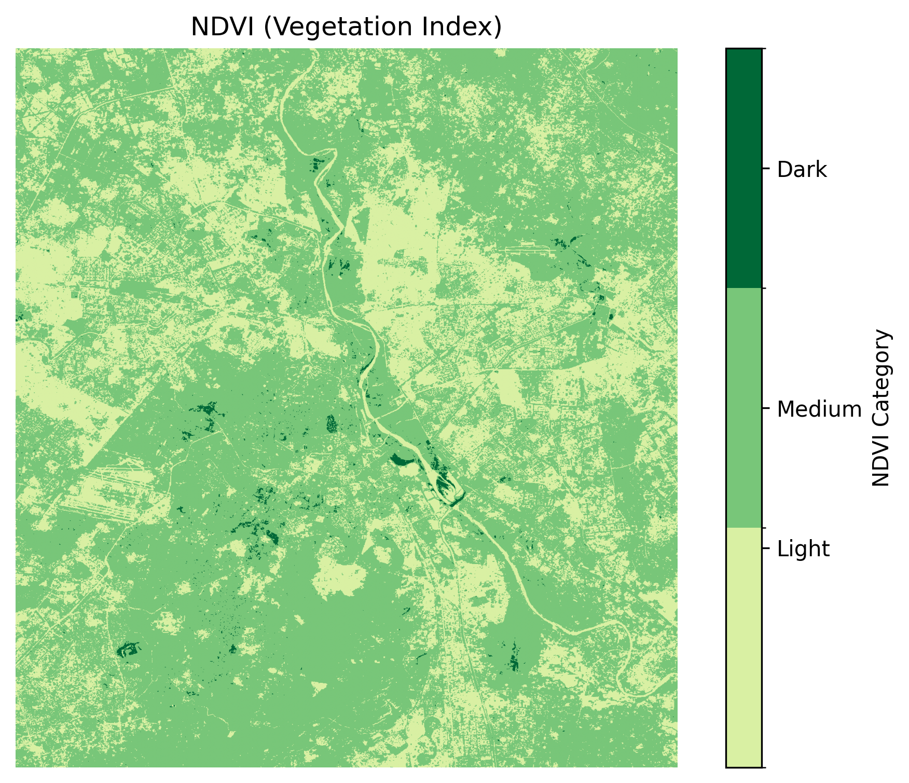
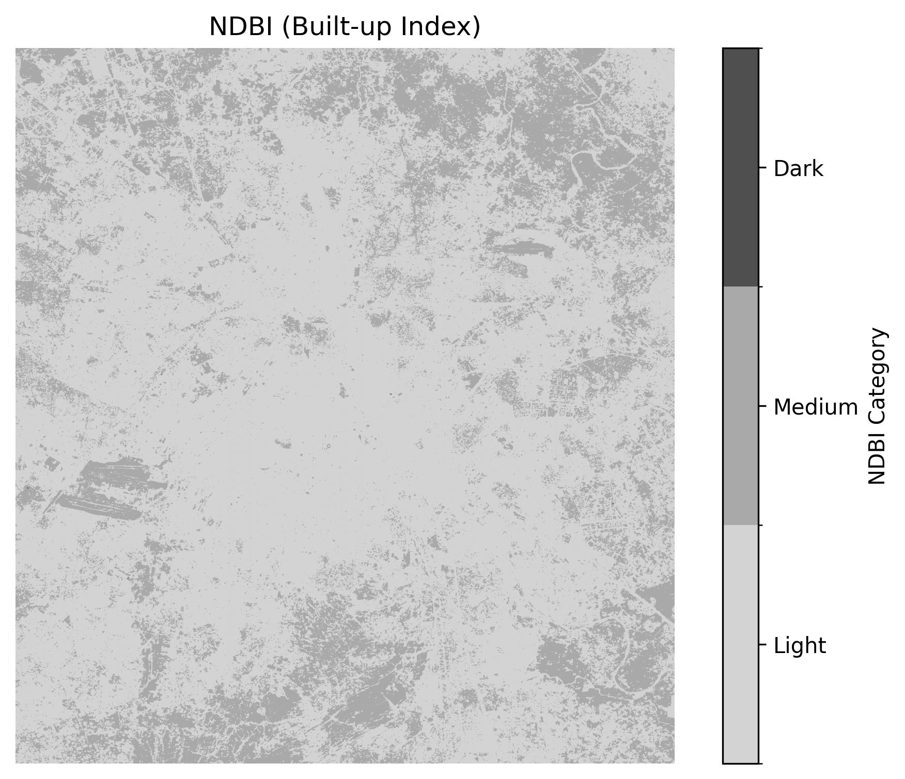
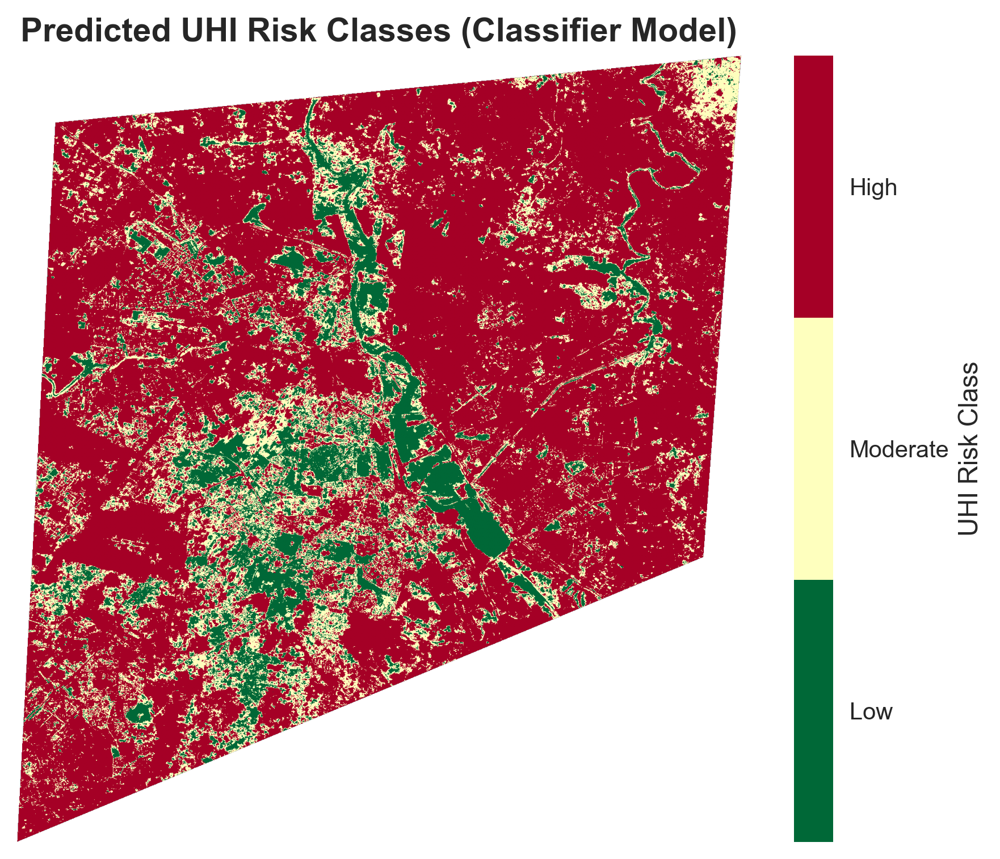
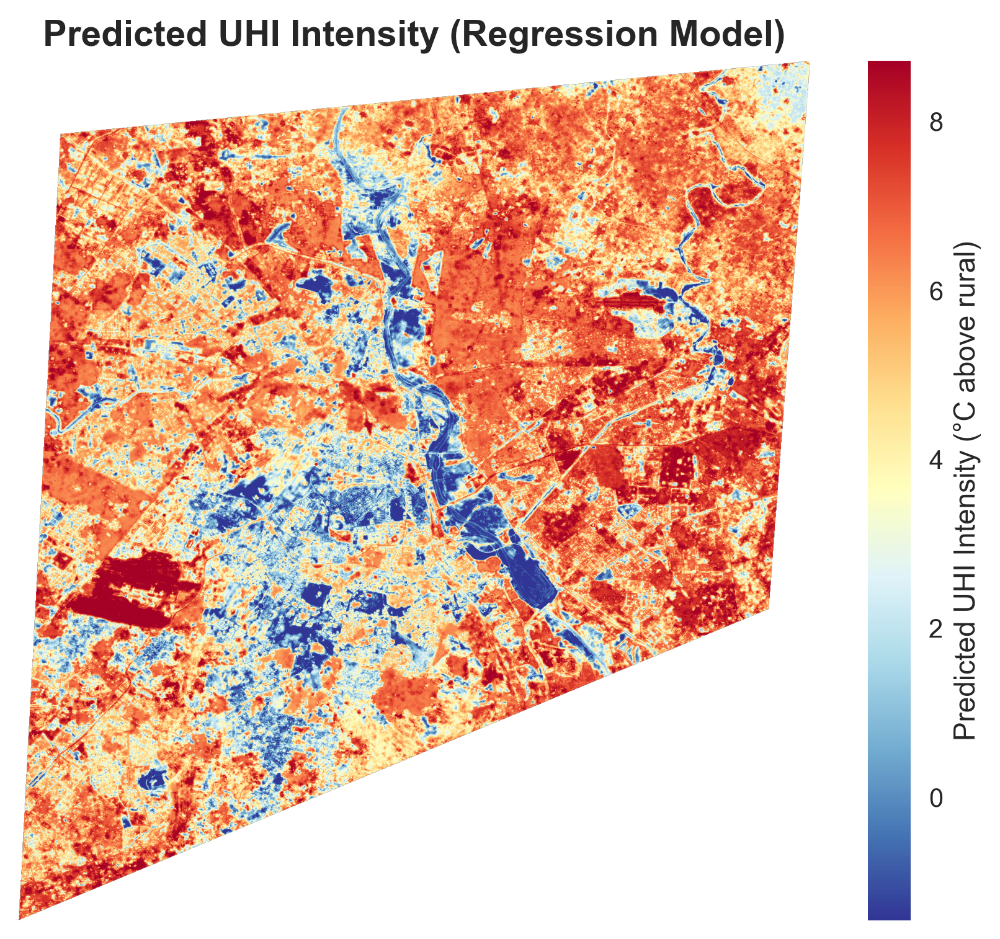

# Urban Heat Island Analysis and Prediction System

## Overview
This project analyzes and predicts **Urban Heat Island Intensity (UHII)** in the **Delhi NCR region** using satellite imagery, environmental variables, and machine learning.

The system processes **Landsat 8 satellite imagery** to extract multiple geospatial indices and combines them with weather data to model urban heat patterns.

A machine learning pipeline using **LightGBM** is used to:

- Predict **Urban Heat Island Intensity (UHII)** as a continuous value (regression)
- Classify regions into **different heat intensity levels** (classification)

An interactive dashboard built with **Streamlit** allows users to explore results and visualize heat patterns.

---

# Study Area and Data

## Study Area
Delhi NCR Region, India

## Time Period
Pre-monsoon season:  
**April – June (2018–2025)**

## Satellite Data
Satellite imagery retrieved from **Google Earth Engine API** using **Landsat 8** datasets.

## Additional Data Sources
- Weather variables
- Digital Elevation Model (DEM)
- Land Use Land Cover (LULC)

---

# Feature Engineering

A total of **37 features** were extracted to model urban heat dynamics.

## Target Variable
- **UHII (Urban Heat Island Intensity)**

---

## Raw Spectral Indices
- NDVI (Normalized Difference Vegetation Index)
- NDBI (Normalized Difference Built-up Index)
- MNDWI (Modified Normalized Difference Water Index)
- Land Surface Emissivity
- Fractional Vegetation Cover (Pv)
- DEM (Elevation)
- LULC classes
- Rural LST baseline

---

## Weather Features
- Air temperature
- Humidity
- Pressure
- Wind speed
- Cloudiness

---

## Spatial Texture Features
Local spatial statistics capturing variation in the surrounding environment:

- NDVI local mean and standard deviation
- NDBI local mean and standard deviation
- MNDWI local mean and standard deviation
- Emissivity local mean and standard deviation

---

## Interaction and Environmental Features
Advanced features capturing complex urban heat behavior:

- Vegetation cooling efficiency
- Urban heat capacity
- Heat retention factor
- Urban canyon proxy
- Evapotranspiration potential
- Latent heat proxy
- Sensible heat proxy
- Thermal comfort index
- Urban green ratio
- Green radiation balance
- Spatial heterogeneity
- Thermal inertia proxy
- Water cooling potential
- Water proximity effect
- Blue–green balance

---

# Machine Learning Models

Two models were trained using **LightGBM**.

## Regression Model
Predicts continuous **Urban Heat Island Intensity (UHII)**.

Model file:

models/lgb_regressor.pkl

---

## Classification Model
Classifies areas into **different heat intensity categories**.

Model file:

models/lgb_classifier.pkl

---

# Project Structure

Urban-Heat-Island-System
│
├── notebooks
│   ├── landsat_lst.ipynb
│   ├── model_building.ipynb
│   └── model_testing.ipynb
│
├── outputs
│   ├── lst_map.png
│   ├── ndvi_custom.png
│   ├── ndbi_custom.png
│   └── training_data_with_weather.csv
│
├── models
│   ├── lgb_classifier.pkl
│   └── lgb_regressor.pkl
│
├── UI-dashboard
│   ├── app.py
│   └── style.css
│
├── utils.py
└── README.md

---

# Workflow

Landsat 8 imagery
        ↓
Spectral indices (NDVI, NDBI, MNDWI)
        ↓
LST and emissivity estimation
        ↓
Weather + environmental features
        ↓
Feature engineering (37 features)
        ↓
LightGBM training
        ↓
UHII prediction
        ↓
Streamlit visualization dashboard

---

# Visualization Outputs

## Land Surface Temperature (LST)

Surface temperature distribution derived from Landsat 8 thermal bands.

---

## Vegetation Index (NDVI)

NDVI highlights vegetation density and its cooling influence on urban heat islands.

---

## Built-up Index (NDBI)

NDBI identifies urbanized and built-up areas that contribute to heat retention.

---

## Urban Heat Island Classification Map

Classification model output showing different urban heat intensity zones across the Delhi NCR region.

---

## Urban Heat Island Regression Map

Regression model output predicting continuous Urban Heat Island Intensity (UHII) values.

---

# Running the Dashboard

Install dependencies:

pip install -r requirements.txt

Run the dashboard:

streamlit run UI-dashboard/app.py

This launches the interactive **Urban Heat Island visualization dashboard**.

---

# Applications

This system can support:

- Urban climate analysis
- Heat mitigation planning
- Green infrastructure planning
- Smart city development
- Climate resilience research

---

# Future Improvements

- Multi-city heat island analysis
- Higher resolution satellite imagery
- Deep learning spatial models
- Real-time monitoring pipeline
- Integration with urban planning tools

---

# Author

Developed as part of a geospatial machine learning project for analyzing and predicting urban heat island patterns using satellite data and environmental features.

